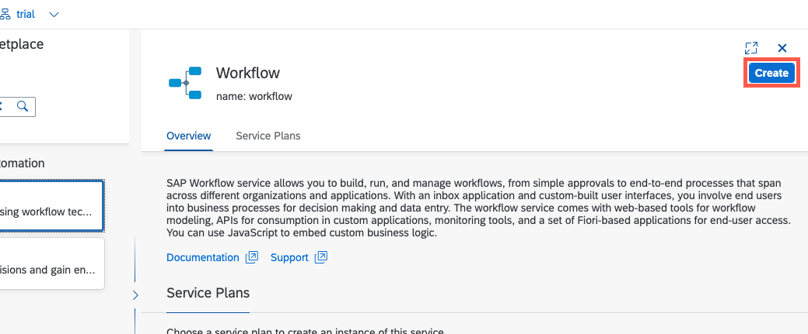
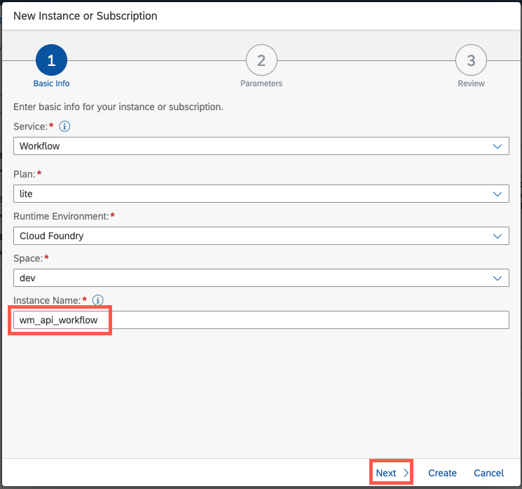
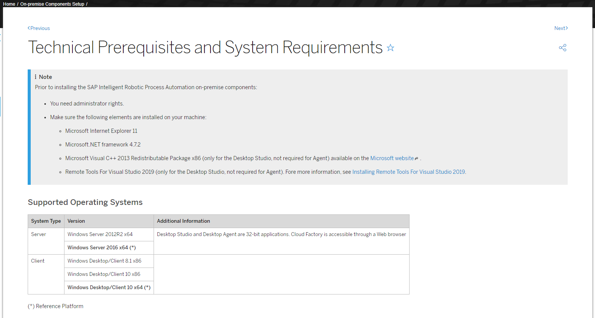
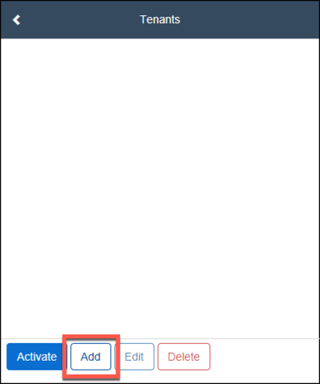

# Introduction and Setup

In this exercise, you will...

## Introduction

Welcome you to this 2 hrs hands-on workshop on the combination of Workflow Management and SAP Intelligent RPA bots. After the session you would be able to run it with your customers.

During this session you will learn how to:

1. Import Capital Expenditure sample workflow content package.
2. Create new process variant using SAP Workflow Management.
3. Create RPA bot to extract input data for Capital Expenditure process.
4. Trigger workflow using RPA Bot.
5. Execute workflow steps in My Inbox.


## Create Trial Account in SAP Business Technology Platform

1. Click on the button **Try for free** on the Free Trials page of SAP Business Technology Platform: [https://www.sap.com/products/business-technology-platform/free-trials.html](https://www.sap.com/products/business-technology-platform/free-trials.html)

    

2. In the page, select the **Individual users** tab and click on the **Sign-up for a free trial** to enter requested information.

    

3. Fill the form and click on **Submit** and wait the Welcome message.

    

4. Click to start your trial experience!

    

5. Verify your account if needed

    

6. You need to **accept** the legal disclaimers for SAP Cloud Platform trial to **Enter your Trial Account**.

    

7. Choose the data center **US East (VA) - AWS** and click **Create Account** to trigger the trial account creation.

    

8. Once done click **Continue**

    

## Setup Workflow Management

1. Click **Boosters**

    

2. Search for **workflow** and click **Start** on Set up account for Workflow Management

    

3. Wait until the different steps are done

    

4. Click **Navigate to Subaccount**.

    

5. Click  **Connectivity -> Destinations**  from the left-hand navigation and search for the destination with name **WM\_CF\_SPACE\_PROVIDER.** Click on the destination to configure its properties

    

6.  In  **Destination Configuration** section, click **Edit**, then **Enter your trial user password** and click **Save**.

    > Caution: Ensure that the **Two Factor Authentication** is [disabled for the user](https://help.sap.com/viewer/6d6d63354d1242d185ab4830fc04feb1/Cloud/en-US/d26427a2c503456bbdfec53d385e0433.html) whose username and password are entered in the destination configuration. If not, then register a new user with 2FA disabled.

    **WM\_CF\_SPACE\_PROVIDER** destination is used in Process Flexibility Cockpit while importing the sample content from API Business Hub. This destination is already created in the previous steps, and now you have configured the credentials for the destination.

    > #### Important Note: You need to change your password in any case since the one that seems to be there is not valid.
    > #### Important Note: If you are using SAP Universal ID then follow this note https://launchpad.support.sap.com/#/notes/3085908

    

#### Create Workflow Service Instance and Key

1. In order to setup a technical user to call the workflow API, create (or update and existing) service instance.
In your trial account, **go to Services -> Service Marketplace**

2. Search for **Workflow**.

3. Click the **Workflow** tile.

    

4. Click the **Create** button to create a new service instance for Workflow.

    We will use this service instance to authorize the corresponding OAuth client to call the workflow APIs

    

5. Click an **Instance Name** (for example, **wm_api_workflow**).

6. Click the **Next** button.

    

7. In line number 2, provide **"WORKFLOW_INSTANCE_START"** as authority (within double quotes).
8. Click the **Create** button.

    >Note: This scope is required to call the API to start a workflow. For more information, refer to [the help documentation](https://help.sap.com/viewer/e157c391253b4ecd93647bf232d18a83/Cloud/en-US/c74f5ff9065b4baeb700d033602ef1d9.html).

    

9.  Click the **View Instance** button, in the confirmation pop-up.

    

10. From the instance that was created (for example, **wm_api_worfklow**), click the **Create** button under Service Keys.

    

11. Click any **name** for the Service Key (for example, **api_key**).
12. Click the **Create** button

    

13. Click the **…** button.
14. Click **View**, to view the OAuth details

    

15. From the Credentials pop-up, note down the following values:
    ```json
    "workflow_rest_url" (line 5)
    "clientid" (line 16)
    "clientsecret" (line 17)
    "url:" (line 18)
    ```

    We shall use these details later.

    

#### Create Role Collection for Workflow Management

1. Once in your trial account, click **trial** tile to enter into the subaccount.

    

2. Open **Security** and select **Role Collections**. Click on **(+)** to create a new role collection with a name.

    

3. Assign the name **LocalManager** and click **Create.**

    

4. Click on the newly created role collection to edit it.

    

5. Click **Edit.**

    

6. Assign your SAP BTP trial user to this role collection

    

7. Click **Save.**

    

8. Repeat these steps for the role collection **CFO**

    

**Congratulations! You have successfully completed the setup of Workflow Management in your account**

## Setup Intelligent Robotic Process Automation

1. Click **Go To Your Trial Account**

    

3. Click **Boosters**

    

4. Search for **rpa** and click **Start** on Set up account for Intelligent RPA

    

5. Wait until the different have been done.

    

6. Click **Navigate to Subaccount**.

    

## SAP Intelligent Robotic Process Automation Factory

2. Click on **Instances and Subscriptions**

3. Click on **SAP Intelligent Robotic Process Automation Trial**

    

4. A new tab will open with the access to the **Intelligent Robotic Process Automation Factory**.
    >You can add the URL of the factory to your **favorites bookmarks** to have an easy access later.

    >**Very important note**: This URL will be asked to be used as tenant when you setup your on-premise Desktop Agent

5. Click **OK** to proceed

    

    **Congratulations! You have successfully completed the setup of Robotic Process Automation in your account**

    


## SAP Intelligent RPA On-premise Installation

1. Check the technical prerequisites and System requirements [here](https://help.sap.com/viewer/6b9c8e86a0be43539b670de962834562/Cloud/en-US/0061438816a34fa78b77c99852318c70.html)

    

2. Get the latest version of the SAP Intelligent RPA MSI from [SAP Development tools](https://tools.hana.ondemand.com/#cloud)
    >**Note**: You will find it all the way in the bottom of the page.

    

3. Installing the components
    - Double click on the MSI and click **Next >**
    - Choose the components to install and click **Next >** for the following steps
    - Click **Install**
    - Wait the installation to complete
    - Click **Finish**

    
    
    
    
    

4. In Windows search bar:
    - Search for **Desktop Agent**
    - Click on **Desktop Agent program**

    

#### Desktop Agent Tenant Registration

1. Open your agent in the task bar, select **...** and **Tenants**

    

2. Click on **Add**

    

3. Enter a tenant **Name** and the **Domain** of your Intelligent RPA Factory (e.g. xxxxtrial.app.irpa-trial.cfapps.us10.hana.ondemand.comx)

    

4. Click on **Activate**

    

5. Click **OK**

    


## Summary

You have now successfully enabled Workflow Management and Robotic Process Automation in your Business Technology Platform Trial account

Go to [Exercise 2: Workflow Management](../ex1/README.md) >

Go to [Exercise 3: Intelligent Robotic Process Automation](../ex2/README.md) >
