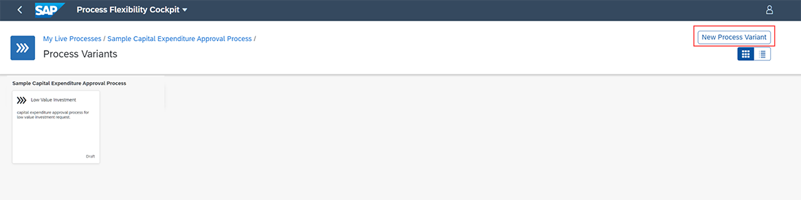
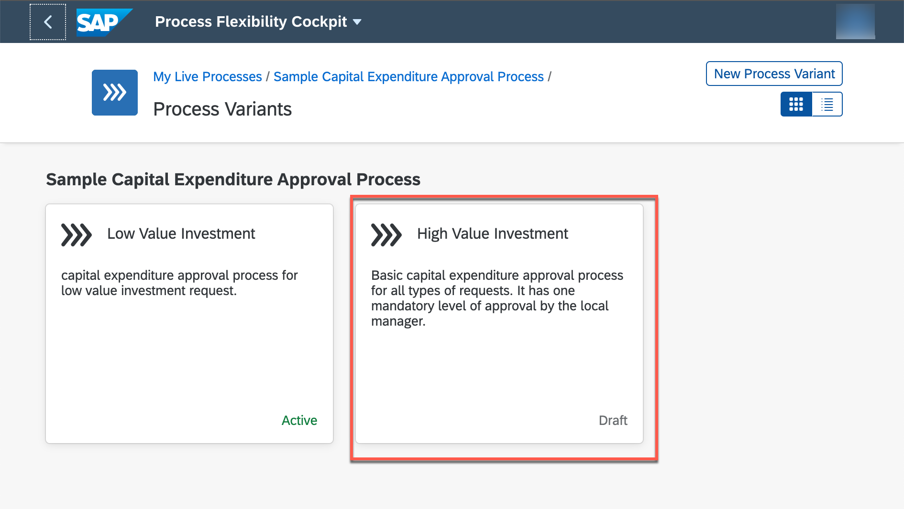
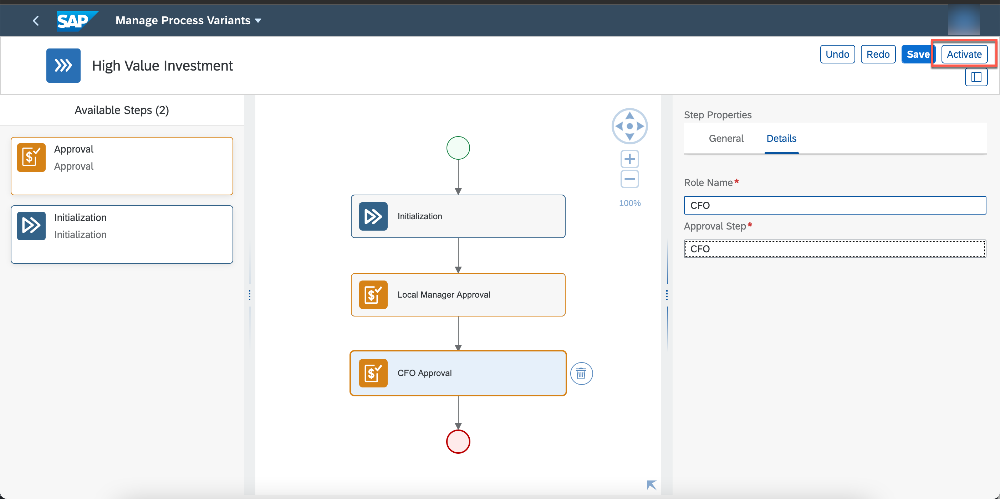
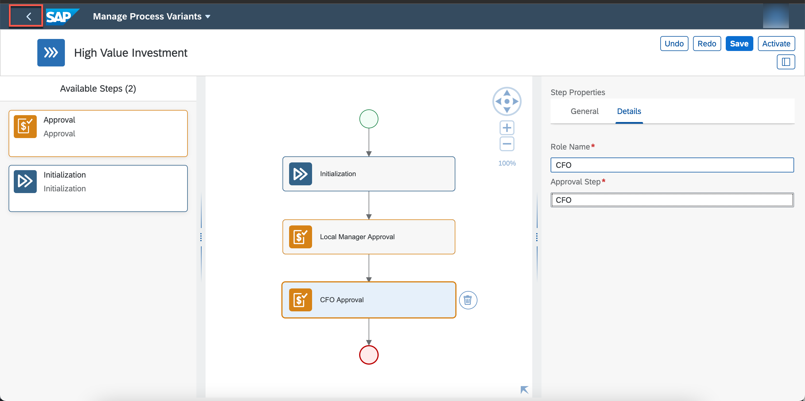
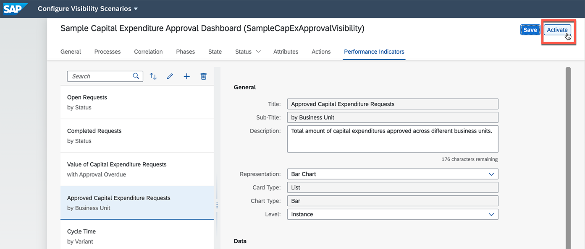

# Discover and configure workflow content with SAP Workflow Management

< Back to [Exercise 0: Introduction and Setup](../exercise0/README.md)

Go to [Exercise 2: Intelligent Robotic Process Automation](../exercise2/README.md) >

## Table of contents

<!-- TOC -->

- [Discover and configure workflow content with SAP Workflow Management](#discover-and-configure-workflow-content-with-sap-workflow-management)
  - [Introduction](#introduction)
  - [Open SAP Workflow Management and import sample content](#open-sap-workflow-management-and-import-sample-content)
  - [Create and configure a process variant](#create-and-configure-a-process-variant)
  - [Manage and configure decisions](#manage-and-configure-decisions)
  - [Configure and activate process visibility scenario](#configure-and-activate-process-visibility-scenario)
  - [Run the new process variant](#run-the-new-process-variant)
  - [Approve the capital expenditure request](#approve-the-capital-expenditure-request)


<!-- /TOC -->

## Introduction

Capital Expenditure process starts when any company receives a funding
request for capital expenditures. These requests are then thoroughly
reviewed, evaluated and finally approved or rejected based on the
available budgets for the current period. Approval is not straight
forward. There are many rules that are involved to determine how many
levels of approvals will be there or who will approve it based on the
investment details.

There are many challenges with capital expenditure process and companies
are always looking for managing investment decisions in a transparent
way. Automating capital expenditure approval process enables customer to
accelerate investment decisions and to bring the agility into every step
and decision such that the corporate policies are followed while taking
the investment decisions. 

In the following exercise you will create a new capital expenditure
process, based on a pre-built live process content package.

## Open SAP Workflow Management and import sample content

Prerequisites are done:
  -   Trial account available
  -   SAP Workflow Management setup done (via booster)
  -   Destination is configured


1. Go to <https://account.hanatrial.ondemand.com/trial/#/home/trial>

2. Click **Go To Your Trial Account.**

    

3. Go back to the **trial** subaccount.

4. Open your trial account, > click on **trial**.

    

5. Go back to the **trial** subaccount.

6. Click **Instances & Subscriptions**.

    

7.  Click on **Workflow Management** to open the application.

    

8. Choose the tile **Process Flexibility Cockpit**

    

9.  Choose **Discover Packages.**

    

10. Search for **sample** and click on **Sample Capital Expenditure Approval Process.**

    

11. Click on **Import**. (**Note:** The import process can take some time!)

    In the **Import Package** popup, click **Import** to continue.

    

12. Click on **My Live Processes** link on top left to go back the to Live Processes dashboard.

    


13. Click on the **Sample Capital Expenditure Approval Process** to navigate into the package to activate the process variant and the business rules.

    

14. As you go into the package, click on the variant **Low Value Investment**.

    

15. Click **Activate** button to deploy the process variant into your SAP BTP tenant. Click **Yes** to confirm the activation.

  > When you activate the process variant, a workflow is generated and deployed in your account.

    
    ###
    
    ###  
    
    ###  
    

16. Go back to the sample package, click on **DetermineLocalApprovers** rule from **Decisions** tile.

    

17. In the **Manage Decisions** application, click on **Activate**. This will activate and deploy the business rules required for the sample workflow.

    

#### Congratulations, you have imported and activated your first content package in SAP Workflow Management.

## Create and configure a process variant

A process variant consists of multiple process steps configured by a line-of-business expert. You can create multiple process variants depending on the number of approval steps to configure for the capital expenditure approval process.

In this exercise, you can configure one such approval step and activate a process variant.

1. In the  **Process Flexibility Cockpit** , navigate to  **My Live Processes**  section and choose  **Sample Capital Expenditure Approval Process**  tile.

    

2. Choose the  **Process Variants**  tile.

    

3. Select **New Process Variant.**

    

4. Enter Name: **High Value Investment** Select **Create.**

    The  **Process**  dropdown is preselected as **Sample Capital Expenditure Process.** This process refers to the template from which the new variant will be created. A template contains the process steps that are used to configure the different process variants based on business needs.

    

5. Choose the newly created  **High Value Investment**  process variant tile.

    

6. In the  **Manage Process Variants**  view, add a new approval step to the template by dragging the  **Approval**  tile from  **Available Steps**  and drop it after the  **Local Manager Approval**  step.

    

7. Choose the new approval step that opens the  **Step Properties**

    

8. In the  **Step Properties**  section, modify the name of the step to **CFO Approval.**

    

9.  Choose the  **Details**  tab, then change the  **Role Name**  to  **CFO**  and  **Approval Step**  to  **CFO**.

    

10. **Save** and then **Activate** the new process variant.

    

11. Go back.

    

12. The new process variant **High Value Investment** is now active.
   Click **Sample Capital Expenditure Approval Process** to go back.

    

#### Congratulations, you have now created and activated a new process variant, based on the pre-built content package.

## Manage and configure decisions

You can view, edit, author, and activate your business decisions using  **Manage Decisions**.

A decision consists of one or more policies, and each policy consists of a collection of rules. It is a part of the live process package and is used to automate the decision making parts of a business process.

You configure the auto approval policy in this exercise. This policy is used to determine if an approval is required or not, based on the total investment cost. In this scenario, auto approval is enabled if the investment cost is less than 20000.

1. Select **Determine All Approvers** in **Decisions.**

    

2. Choose the  **Determine All Approvers**  decision, then choose  **Copy to Draft**  to create a draft version of the decision.

    

3. In the warning dialog, choose  **Continue**.

    

4. Choose the  **Auto Approval**  rule.

    

5. Choose  **Edit**.

    

6. Modify the text rule value to  **20000**  and  **Save**  the changes.

    

7. Choose  **Release Version**.

    

8.  In the  **Release Version**  dialog, make note of the version number. Enter a note in the **Description** field and then choose  **Release**.

    

9. Choose the decision with the version number from the previous step and then choose  **Activate**.

    

#### Congratulations, you have now modified the decision for your processes.


## Configure and activate process visibility scenario

Process visibility scenarios allow users to track the performance of end-to-end processes. You can create, edit, delete, and activate a scenario using the Configure Visibility Scenarios application.

In this exercise, you explore the application, modify a performance indicator, and activate the visibility scenario.

1. Select **Go Back.**

    

2. From the  **Visibility Scenarios**  tile, choose  **Sample Capital Expenditure Approval Dashboard**.

    

3. Choose the  **Performance Indicators**  tab.

    

4. Choose  **Approval Capital Expenditure**  and change the  **Representation**  to  **Bar Chart**. Once done, choose  **Save**.

    

5. Choose  **Activate**.

    

#### Congratulations, you have now adapted the process visibility scenario. Of course, you are free to add further performance indicators or change the existing ones.

## Run the new process variant

In this exercise, you start a new instance of the workflow that is generated from the process variant that you have created. This instance will have the total cost of the order as 50000, which requires a manual approval. Upon starting the workflow instance, the task will be available in My Inbox for your approval.

> Remark: you will see here how to start the workflow for testing purposes, in real scenario you would choose other mechanisms like starting the workflow from API.

1. Navigate to the Workflow Management home screen by choosing  **Home**.

    

2. In the Workflow Management home screen, choose the  **Monitor Workflow - Workflow Definitions**  tile.

    

3. Choose the  **High Value Investment**  workflow definition, then choose  **Start New Instance**.

    > Remark: the ID of this new workflow definition has been created automatically based on the given process variant name. **Please note down this ID** , you will need it later when you define the RPA bot and trigger the workflow via SAP Intelligent Robotic Process Automation. It should be: **highvalueinvestment**

    

4. In the  **Start New Instance**  popup menu, replace the existing JSON snippet with the below snippet.

    >Important: Make sure you are using the **email address from your SAP BTP trial account** for "Email" and "UserID".

    Choose  **Start New Instance and Close**.

    ```json
    {
        "RequestId": "IAP-2020-180",
        "Title": "App Creation",
        "Requester": {
            "FirstName": "John",
            "LastName": "Doe",
            "Email": "<your email address in SAP BTP trial>",
            "UserId": "<your email address in SAP BTP trial>",
            "Comments": "Please Approve"
        },
        "Investment": {
            "TotalCost": 50000,
            "Type": "Software",
            "CAPEX": 10000,
            "OPEX": 2000,
            "ROI": 5,
            "IRR": 5,
            "Country": "Germany",
            "BusinessUnit": "Purchasing",
            "Description": "Provide a fresh experience for our customers by providing new apps for our services"
        },
        "Sustainability": {
            "EnergyEfficiency": 10,
            "CO2Efficiency": 20,
            "EnergyCostSavings": 15,
            "WaterSavings": 10
        },
        "internal": {
        }
    }
    ```

    

5. Choose  **Show Instances**.

    

6. You can view the workflow instance created for approval. You can navigate to the  **Execution Log**  to ensure that the subflow for Local Manager Approval has started as shown.

    

#### Congratulations, you have successfully started the new process variant for high value investments.


## Approve the capital expenditure request

In this exercise, you will first approve the task created for the local manager. After the approval, the process moves to the next approval level for the CFO approval. You will again receive a task in My Inbox, where you can approve the task to complete the capital expenditure approval process.

1. Navigate to Workflow Management home screen, choose  **My Inbox**  tile.
You can see that there is one task that requires your approval.

    

2. Choose the approval task from the **All Tasks** list. You can view details of the task that requires your action such as, Investment Details, Sustainability, Investment Requester, History, and Comments.

    

3. Choose  **Approve**  to approve the capital expenditure request.

    

4. Similarly, you would have a new task in the  **My Inbox**  tile for your approval as a CFO. Act accordingly.

    

#### Congratulations, you have done all the approvals for this new capital expenditure request.


## You have completed the exercise!

You are now able to:

1. Discover, import and configure live process content packages in SAP Workflow Management.
2. Run newly created process variants.

Now you are ready for Exercise 2.

Go to [Exercise2: Intelligent Robotic Process Automation](../exercise2/README.md) >

< Back to [Exercise0: Introduction and Setup](../exercise0/README.md)
