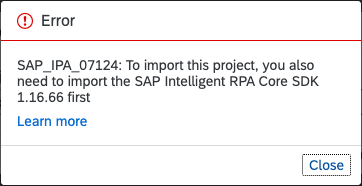
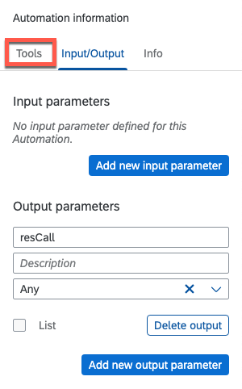
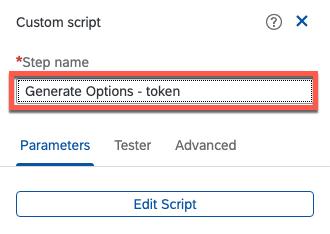
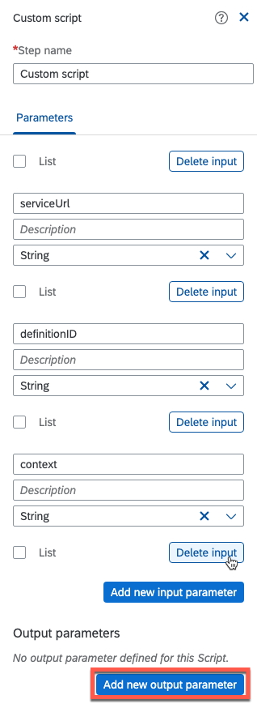
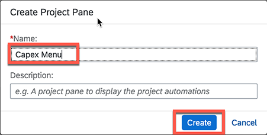
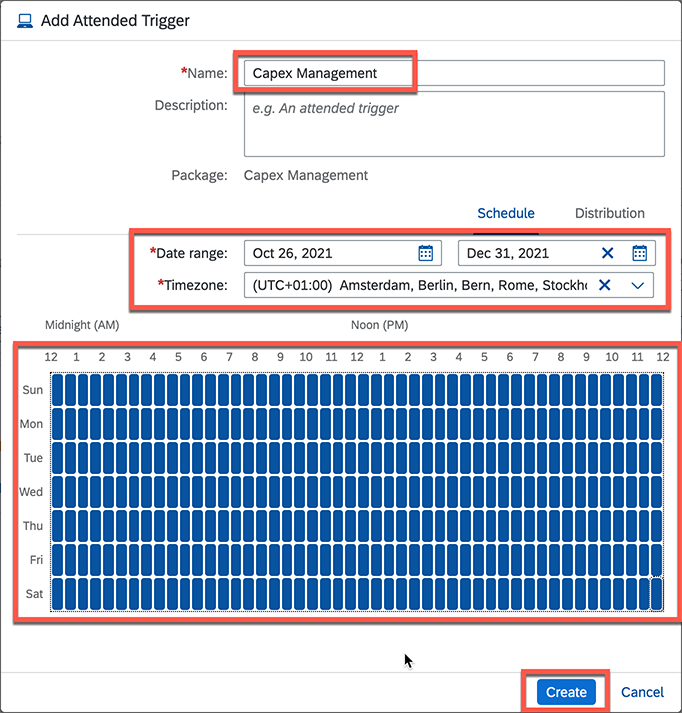

# Build a digital bot with SAP Intelligent Robotic Process Automation

< Back to [Exercise0: Introduction and Setup](../exercise0/README.md)

< Back to [Exercise1: SAP Workflow Management](../exercise1/README.md)

## Table of contents

<!-- TOC -->

  - [Introduction](#introduction)
  - [Overview](#overview)
  - [Pre-requisites](#pre-requisites)
  - [Factory Settings](#factory-settings)
    - [Agent connection check](#agent-connection-check)
    - [Create a Test Environment](#create-a-test-environment)
    - [Add an Agent to the Environment](#add-an-agent-to-the-environment)
  - [Build your Bot in Cloud Studio Project](#build-your-bot-in-cloud-studio-project)
    - [Import the provided Project](#import-the-provided-project)
    - [Create a Project from scratch](#create-a-project-from-scratch)
    - [Create an Automation, configure the Agent version and build the automation](#create-an-automation-configure-the-agent-version-and-build-the-automation)
    - [Test the automation project](#test-the-automation-project)
    - [Add a Project Pane for automations menu items](#add-a-project-pane-for-automations-menu-items)
  - [Get your project ready](#get-your-project-ready)
    - [Generate and release a Package from your Project](#generate-and-release-a-package-from-your-project)
    - [Add a Package to the Environment](#add-a-package-to-the-environment)
    - [Add a Trigger for the Package](#add-a-trigger-for-the-package)
    - [Check Agent Mode and Project Assignment](#check-agent-mode-and-project-assignment)
  - [Approve the capital expenditure request](#approve-the-capital-expenditure-request)
    - [Congratulations, you have done all the approvals for this new capital expenditure request, which has been started via a digital bot.](#congratulations-you-have-done-all-the-approvals-for-this-new-capital-expenditure-request-which-has-been-started-via-a-digital-bot)
  - [Conclusion](#conclusion)

<!-- /TOC -->

## Introduction

In this session, you will learn how to use the SAP Intelligent RPA to build your first bot that calls a Workflow Management service and triggers Capital Expenditure Approval Process.


## Overview

Handling data from different sources to prepare them for business processes in several and heterogenous applications is a challenging task. Moreover, when the data are collected form the UIs of these applications. With SAP Intelligent RPA, you have a complete toolbox that allows you building all kind of automations to cope these challenges.

The challenge we will resolve in this session is related to Capital Expenditure Approvals in Workflow Management. The process starts when any company receives a funding request for capital expenditures. These requests are then thoroughly reviewed, evaluated, and finally approved or rejected based on the available budgets for the current period.

We assume all the approvals are already handled inside a Workflow Management use case and think how the workflow could be triggered using SAP Intelligent RPA. The bot will:

  - Read data from JSON file
  - Prepare a payload of the workflow service based on environment variables (like Workflow ID, API end point and Credentials) stored in the Cloud Factory in a secured way.
  - Handle the call of the web service authenticating and getting the required token.
  - Posting the CAPEX request with the needed payload.
  - Get the result of the request confirming that the workflow is triggered.

In addition to building your bot, you will experience some RPA Officer tasks and explore others on your own:

  - Creating an Environment and add your Desktop Agent.
  - Generate a Package and release it.
  - Deploy a Package to an Environment and add a Trigger.
  - Check your Desktop Agent mode.
  - Explore Monitoring Jobs, Agents Groups, Alerts, Content from the Store.


  [

**Pre-requisites**

To be able to execute the following Hands-on, you need:

1. SAP Intelligent RPA Cloud Factory access as IRPRA Officer
2. Windows machine with on-premise components installed

Please, check the technical prerequisites and System requirements in the official documentation [here](https://help.sap.com/viewer/6b9c8e86a0be43539b670de962834562/Cloud/en-US/0061438816a34fa78b77c99852318c70.html), and refer to the Setup Guide provided to you.

- JSON file [request.json](Files/request.json) containing the context of the CAPEX Request that will be handled in the business process.

This file should be in this folder `c:\users\Public\saprpa`

And should follow the following JSON template.

> **Important:** Make sure you are using the email address from your SAP BTP trial account for "Email" and "UserId" in this file.


```json
{
  "RequestId": "Investment Approval 01",
  "Title": "App Creation",
  "Requester": {
    "FirstName": "John",
    "LastName": "Doe",
    "Email": "<your email address in SAP BTP trial>",
    "UserId": "<your email address in SAP BTP trial>",
    "Comments": "Please Approve"
  },
  "Investment": {
    "TotalCost": 50000,
    "Type": "Software",
    "CAPEX": 10000,
    "OPEX": 2000,
    "ROI": 5,
    "IRR": 5,
    "Country": "Germany",
    "BusinessUnit": "Purchasing",
    "Description": "Provide a fresh experience for our customers by providing new apps for our services"
  },
  "Sustainability": {
    "EnergyEfficiency": 10,
    "CO2Efficiency": 20,
    "EnergyCostSavings": 15,
    "WaterSavings": 10
  }
}
```

## Factory Settings

### Agent connection check

1. Go back to the **trial** subaccount.

2. Click on **Instances and Subscriptions**

3. Click on **SAP Intelligent Robotic Process Automation Trial**

    

4. Click on **Agents** tab

    

5. Check that your **Agent** is listed with status **Idle**

    

### Create a Test Environment

1. Navigate to **Environments**

2. Click on **New Environment**

    

3. Set a **Name** for the Environment (ex. **Test Environment**)

4.Choose **Test** as Type

5. Click on **Create**

    

### Add an Agent to the Environment

1. In the Environment, click on **Add Agent**

    

2. Select your Agent

3. Click on **Add agent**

    

4. The Environment is now configured with your Agent

    

## Build your Bot in Cloud Studio Project

> For this part we offer you two possibilities
>   - [Import the provided Project](#import-the-provided-project)
>   - [Create a Project from scratch](#create-a-project-from-scratch)
>
> Please select your desired possibility above
### Import the provided Project

1. Download the [CapexMananagement.zip](Files/CapexManagement.zip) containing the entire project

2. Before you can import the project file you need to get the Core SDK. To do this go to the **Store** tab, check the catalog **SAP Intelligent RPA SDK**, put **Core** in the search field, press the search button and select the **Core SDK**.

    

3. Click on the **Get** button to download the SDK

    

4. In the Factory, click on the **Projects** tab

    

5. In the Projects page click on **Import**

    

6. Select the downloaded file and press **Import**

    

    > Note: You may get a error message that the project file requires a different SDK version. To fix this go back to the store, select **Show All Versions** and **Get** the version needed for the project.

    

    

    

#### Congratulations! you have sucessfully imported the project.


> #### You can now skip the next section and continue with section [Get your project ready](#get-your-project-ready)

### Create a Project from scratch

1. In the Factory, click on the **Projects** tab

    

2. In the Projects tab click on **New Project**

    

3. Set a **Project Name**

4. Click **Create**. This will open the IRPA Cloud Studio in the next tab.

    

5. In the left panel, click on the **Gear** to open the Settings

    

6. Select the **Environment Variables/Set Environment Variables**

    

7. Click on **Create**

    
8. Set **definitionID** as Identifier

    

9.  Click on the **Type** list

    

10. Select **String**

    

11. Click on **Create**

    

12. Follow the same step to create 4 variables similar to what is shown in the screenshot:
    - **serviceUrl** : as String
    - **uaaClientId** : as String
    - **uaaClientSecret** : as Password
    - **uaaUrl** : as String

    

13. Once done, click on Close

    

### Create an Automation, configure the Agent version and build the automation

1. In the left-hand Panel and click on the **+** button and select **Create**

2. Select **Automation**

    

3. Click on the **Agent version** list

4. Select the latest localversion released

    > **Note** : if Local is not shown, choose the version of the Desktop agent installed in your machine.

    

5. Click on **Confirm**

    

6. Set a **Name** for the automation

7. Click on **Create**

    

8. In the right-hand panel, Click on the **(Input/Output)** tab and click on **Add new output parameter**

    

10.  Set the **Name** of the Parameter to **resCall**

11. Click on **Type** list

12. Choose type **Any**

    

13. Click on **Tools**

    

14. Search for the **Read File** activity

    

15. Drag the **Read File** activity

16. Drop it on the automation flow

    

17. Click on the **Read File** activity to edit the Step details

    

18. Set the **filePath** to the json file of the Capex request you have prepared (e.g. `c:\users\Public\saprpa\request.json`)

19. Select the **proposed value** as String

20. Click on the **reset** button of the **content** output parameter to rename it

    > **Note** : Make sure you have a json file with name**request.json** with the required start context in**C:\Users\Public** . The bot will read the file to determine the payload to start the workflow.

    

21. Set **Name** of the output parameter to **context**

    

22. Click on Close

    

23. Clear the **search field**

    

24. Search the **Encode String** activity:

25. Drag it

26. Drop it on the automation flow

    

27. Click on the activity to edit the details

    

28. Click on the **Expression Editor**

    

29. Set the value of the input to:

    `$.uaaClientId + ':' + $.uaaClientSecret.toString()`

30. Click on **Save Expression**

    


31. Clear the **name** of the output parameter

    

32. Set the name to: **clientInfo**

    

33. Click on Close the step properties

    

34. Clear the **search field**

    

35. Search for **Custom Script** activity and drag and drop it to the workflow

    

36. Click on the **Custom Script** activity

    

37. Rename the Step name to: **Generate Options - token**

    

38. Click on the **Edit Script** button or Double-click on the **Custom Script** to open the script editor.

    In addition to the Step Details on the right, a large panel will open in the middle for the custom code.

    

39. Adding 2 input parameters: (**clientInfo** and **uaaUrl**) and 1 output parameter: **optionsGet**

40. In the right-hand panel, Click on **Add new input parameter**

    

41. Set name to: **clientInfo**

    

42. Click on **Add new input parameter**

    

43. Set name to: **uaaUrl**

    

44. Click on **Add new output parameter**

    

45. Set name to: **optionGet**

    

46. Click on the **Type** list

47. Select type **Any**

    

48. Copy the following code into the script editor:

    ```javascript
    return {
        method: 'GET',
        url: uaaUrl + '/oauth/token?grant_type=client_credentials',
        responseType: 'json',
        resolveBodyOnly: true,
        headers:{
            Authorization:'Basic ' + clientInfo
        }
    };
    ```

    

49. Click on Close the Editor

    

50. Click on the **Generate Options -token** step

    

51. Click on the **clientInfo** field, and Select the **clientInfo** form the available variables (result of step 2)

    

52. Click on the **uaaUrl** field, and Select the **uaaUrl** form the available variables (environment variable)

    

53. Click on Close step Details

    

54. Clear the **search field** and Search for the **Call We Service** activity

    

55. Drag the **Call Web Service** activity

56. Drop it on the automation flow

    

57. Set Step name as: **Call Web Service – Get**

    

58. Set the **options** to: **optionGet** (result of Step 3)

    

59. Clear the output parameter

60. Set a name as: **resToken**

    

61. Click on Close the Step details

    

62. Clear the **search field** and Search for the **String** activity

    

63. Drag the **String** activity from Data Type

64. Drop it on the workflow

    

65. Click on the **Create string variable** to edit the **Step** **details**

    

66. Open the **Expression Editor**

    

67. Add
    ```javascript
    'Bearer ' + Step4.resToken.access_token
    ```

68. Click on **Save Expression**

    

69. Clear the output parameter

    

70. Set Name to: **authToken**

    

71. Click on Close Step Details

    

72. Clear the **search field** and Search for **Custom Script** activity

    

73. Drag the **Custom script** activity
74. Drop it on the automation flow

    

75. Double-click on the **Step** to show **details** panel and open **script editor**

    

76. Add the following input parameters:

    - **token** as String
    - **serviceUrl** as String
    - **definitionID** as String
    - **context** : as String

    

77. Add the output parameter: **optionsUpload** with type **Any**

    

78. Copy the following code to the **script editor** :

    ```javascript
    let input = {
        "definitionId": definitionID=="default"?"highvalueinvestment" : definitionID,
        "context": irpa_core.unserialize(context, true)
    };return {
        method: 'POST',
        url: serviceUrl+"/v1/workflow-instances",
        responseType: 'json',
        resolveBodyOnly: true,    headers:{
            Authorization: token,
            'Content-Type': irpa_core.enums.request.content.json
        },
        json: input
    };
    ```

    >Remark: Ensure you have the same workflow definitionID as defined before for the new process variant in SAP Workflow Management.

    

79. Close the **Script Editor** and Click on the **Custom Script** step

    

80. Set the Step name to **Generate Options - upload**

81. Set the token to **authToken** (output of step 5)

82. Set the serviceUrl to **serviceUrl** (environment variable)

83. Set the definitionID to **definitionID** (environment variable)

84. Set the context to **context** (output of step 1)

    

85. Check the final settings and Click on Close Step details

    

86. Clear the **search field** and Search for **Call Web Service** activity

    

87. Drag the **Call Web Service** activity

88. Drop it on the automation flow

    

89. Click on **Call Web Service** activity to edit the Step details

    

90. Set the **Step name** : **Call Web Service – POST**

    > **Note** : renaming the activities allows you to distinguish the steps. For example, in this automation, we have 2 Request Calls a GET for the Token and a POST of the request.

    
|
91. Set input parameter options to **optionsUpload** (output of step 6)


92. Rename the output parameter to **resUpload**

93. Close the Step details

    

94. Click on the **End** node of the automation

    

95. Set the output parameter resCall to **resUpload** (output of step 7)

    

96. Click on **Save** the automation

    

### Test the automation project

1. Click on the **Play** button

    

2. Choose the Environment you already created
    - uaaUrl
    - definitionID
    - serviceUrl
    - uaaClientId
    - uaaClientSecret


3. Click on the **Test** button

    > **Note** : use the information details of the service you created during the setup steps in section [Create Workflow Service Instance and Key](../1_GettingStarted/README.md#create-workflow-service-instance-and-key).
    >
    > Ensure that the *definitionID* it is the same as created by you in the exercise before (e.g. **highvalueinvestment**).

    

4. The steps are displayed in the timeline, on the left of the automation canvas.

    If the automation is tested without errors:
    - Click on the **End** node in the **Tester**
    - Click to expand the **resCall** node to show the result of the test

    

### Add a Project Pane for automations menu items

1. Click on **+** in the left-hand panel

2. Select the  **Project Pane**

    

3. Set a **Name** as **Capex Menu**

4. Click on **Create**

    

5. Drag the automation **Capex Call**

6. Drop it on the **Project Pane**

    

7. Click on **Save**

    

## Get your project ready

### Generate and release a Package from your Project

1. Check that the project is free of errors in the **Design Console**

    

2. Click on **Generate Package**

    Here, you have 2 potential situations:

    1. If you generate the package for the first time like in the case of this hands-on
        - Set a **Name** for your Package: usually the default proposed
        - Click on **Generate Package**

            

    2. If the project has already a generated package, you will be asked to choose among the 3 options.
        - Select the suitable option for your package and this will update the version number accordingly
        - Click on **Generate Package**.

             

3. Navigate to the Cloud Factory and then go to the **Packages** tab

4. Click on the **>** arrow on Capex Management, select your version and click **...** for more options

5. Click on **Release**

    

6. Click on **Release** to confirm

    

7. Click on **Environment** tab

    

8. Click on your **Environment**

    

### Add a Package to the Environment

1. Click on **Add Package**

    

2. Select the **Generated Package**

3. Click on **Next**

    

4. Set Environment Variables:
    - In **definitionID** : Set the workflow definition id

        > **Remark** : ensure it is the same as created by you in the Workflow Management exercise before (e.g. **highvalueinvestment**)

    - In **uaaClientSecret** : Set the client secret value of the workflow service instance key.

    - In **uaaUrl:** set the authentication Url of the workflow service instance key.

    - Scroll to the following variables

      > **Note** : use the information details of service you created during the Onboarding steps in section [Create Workflow Service Instance and Key](../1_GettingStarted/README.md#create-workflow-service-instance-and-key)


  - 

5. In **serviceURL** : set the end point Url of the workflow service instance key.

6. In **uaaClientId** : set the client Id of the workflow service instance key.

7. Click **Ok**

    > **Note** : use the information details of service you created during the Onboarding steps in section [Create Workflow Service Instance and Key](../1_GettingStarted/README.md#create-workflow-service-instance-and-key)

    

    Your package will be seen in your Environment **without trigger**

    

### Add a Trigger for the Package

1. Click on **Add Trigger**

    

2. Select the **Deployed Package** for which you will add the **Trigger**

3. Click on **Next**

    

4. The Environment variables were set when the package was deployed into the environment, if you don't need to update them, Click on **Next**

    

5. Choose **Attended** Trigger

6. Click on **Next**

    

7. Add/tune your Trigger settings
    - Set a **Name**
    - **Define** **Date range** and **Timezone**
    - **Customize** you **daily availabilities** for the weekdays
    - Click on **Create**

    

The environment is now set up with:
  - An agent
  - A Capex Management package
  - Five Environment variables
  - An Attended trigger for the package


### Check Agent Mode and Project Assignment

1. Check if the **Desktop Agent** is started from the **Systray**
      - If yes, ignore the steps below
      - If not, do the steps below

      1. Search for **Desktop Agent**
      2. Click on **Desktop Agent**

      

2. Click on the **Desktop Agent Systray**

3. Click on **Projects** to check the **Agent mode**

    

5. Check that the agent is set to **Interactive (attended)** mode

    

6. If the agent is in test mode click on the three dots to restart it

    

11. Click on **Projects**

    

12. Check the project **Capex Management** exists in the list

13. Click on **Start**

    

    Your **Desktop Agent** will restart with your project ready to test!

14. Click on the **Desktop Agent Systray**

15. Click on your automation **Start Capex Call** to start

    

## Approve the capital expenditure request

Now you have started the workflow via the RPA bot.

Let us now approve the tasks accordingly within SAP Workflow Management.

In this exercise, you will first approve the task created as a local manager. After the approval, the process moves to the next approval step to the CFO approval. You will again receive a task in My Inbox, where you can approve the task to complete the capital expenditure approval process.

1. Go back to your trial account in SAP BTP Cockpit.
Open the SaaS application" **Workflow Management**", click the three dots and select **Go to Application**.

    

2. Navigate to Workflow Management home screen, choose  **My Inbox**  tile.
You can see that there is one task that requires your approval.

    

3. Choose the approval task from the **All Tasks** list. You can view details of the task that requires your action such as, Investment Details, Sustainability, Investment Requester, History, and Comments.

    

4. Choose  **Approve**  to approve the capital expenditure request.

    

5. Similarly, you would have a new task in the  **My Inbox**  tile for your approval as a CFO. Act accordingly.

    

#### Congratulations! you have done all the approvals for this new capital expenditure request, which has been started via a digital bot.

## Summary

You have now successfully created your Bot that triggers a Workflow for a Capital Expenditure Approval process.

After checking you agent connection, you created your Environment and added your agent to get ready to use the cloud studio.

You went through an automation building process, including the test of the automation and the creation a Project Pane for your Bot.

Last but not least, you did some Officer task where you generated a package from the project and released it. After deploying the package into the environment, you added an Attended trigger and customized the Date range, time zone and daily availabilities.

Starting the Desktop agent allowed you to discover the different Agent Modes and also test your bot in your desktop.

Finally, you approved the related tasks and combined SAP Intelligent Robotic Process Automation with SAP Workflow Management.

< Back to [Exercise0: Introduction and Setup](../exercise0/README.md)

< Back to [Exercise1: SAP Workflow Management](../exercise1/README.md)
